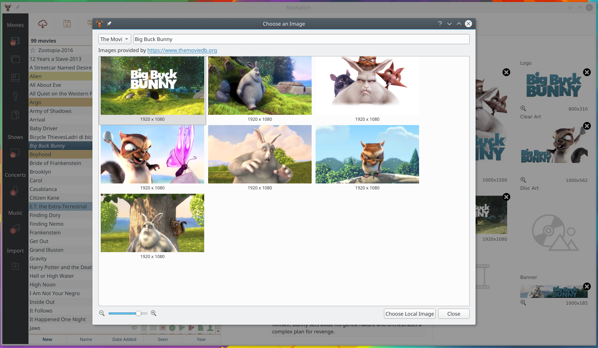

=====
About
=====

.. image:: images/MediaElch.png
   :align: center
   :alt: MediaElch Logo

MediaElch is a MediaManager for Kodi. Information about Movies, TV Shows,
Concerts and Music are stored as nfo files. Fanarts are downloaded
automatically from fanart.tv. Using the nfo generator, MediaElch can
be used with other MediaCenters as well.

Supported scrapers
==================

Included are scrapers for The Movie DB, The TV DB, Kino.de, Videobuster,
OFDb, IMDB and Fanart.tv (and also some adult content scrapers).
The Movie DB and The TV DB are available in more than 20 languages.
Music information is scraped from The Audio DB, All Music and Discogs.
Tv themes and trailers can also be downloaded.

Screenshots
===========

.. figure:: images/screenshots/movie-main.png
   :align: center
   :alt: Movie section

   The Movie section lists your movies which you can browse,
   scrape and edit.

   You can choose from a variety of images (posters, backdrops and more).

.. figure:: images/screenshots/tvshow-main.png
   :align: center
   :alt: TV Show section

   The TV Show section lists your TV shows which you can browse,
   scrape and edit.

.. figure:: images/screenshots/settings-global.png
   :align: center
   :alt: Settings - Global

   Global MediaElch Settings
