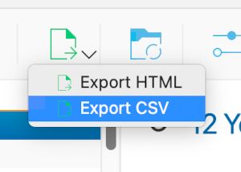
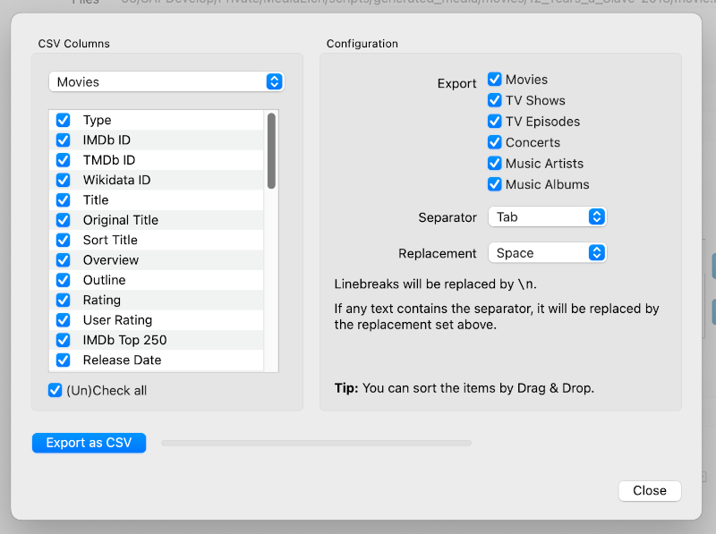

=============
Export to CSV
=============

.. contents::
   :local:
   :depth: 1

You can easily export your movies, TV shows, and more as a CSV file.
Simply select "Export CSV" in the export menu by clicking on the down arrow as shown below:

   Click on the down arrow and select Export CSV

In the dialog that opens, select whatever details you want to export.

   In the "Export CSV" dialog, you can select which details you want to export.

Then click on "Export as CSV" and select where you want to store the CSV files.
After that, MediaElch will create CSV files that can be imported into MS Excel,
LibreOffice Calc and other tools.

.. note::

    It is only possible to export your full library at the moment.  Exporting only
    specific entries is not possible at the moment.
